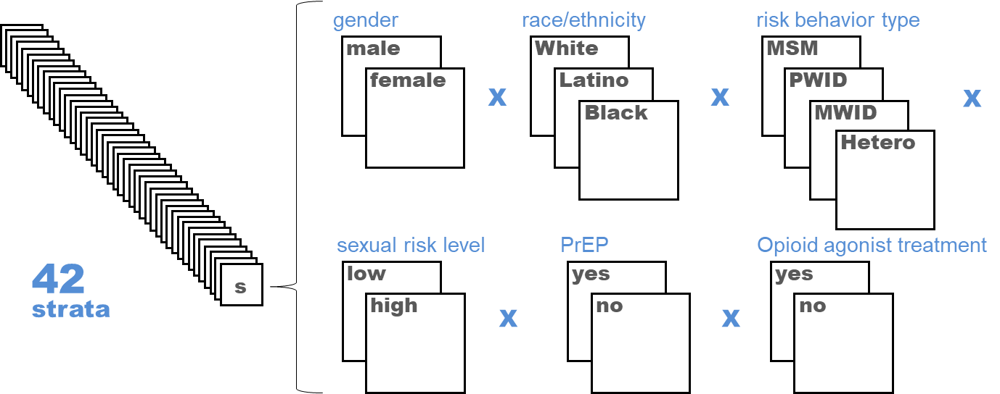
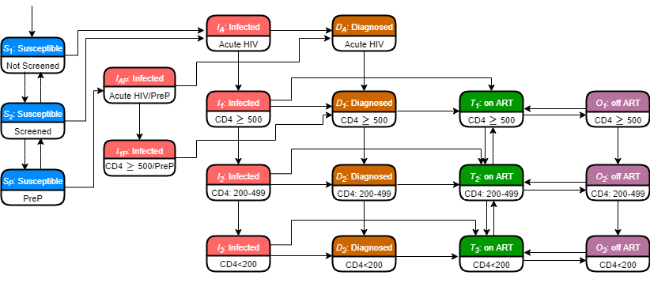

```{r, include = FALSE}
knitr::opts_chunk$set(
  collapse = TRUE,
  comment = "#>"
)
```

```{r include=FALSE, warning=FALSE}
# automatically create a bib database for R packages
# list all R packages that are required by LEM model at this point
knitr::write_bib(c(
  .packages(), "gtools", "openxlsx", "abind", "ggplot2", "reshape2", "gridExtra", "deSolve", "abind", "zoo", "tictoc", "rmarkdown",
    "stringr", "foreach", "doFuture", "rstudioapi", "shiny"
), 'packages.bib')
```


# The LEM model {-}


In this R package, we provide the code and input data for running our dynamic, compartmental HIV transmission model that replicates the city-level HIV micro epidemic for six US cities: Atlanta; Baltimore; Los Angeles (LA); Miami; New York City (NYC); and Seattle (King County) [@core]. We simulate the population of individuals susceptible to HIV through the course of infection (if ever), diagnosis, treatment with antiretroviral therapy (ART), and ART dropout over a time horizon of 20 years [@interventions; @calibration].

In each city, the adult population 15–64 is partitioned by sex at birth, HIV risk group [men-who-have-sex-with-men (MSM), people who inject drugs (PWID), MSM who inject drugs (MWID) and heterosexuals (HET)], race/ethnicity (black/African American, Hispanic/Latinx and non-Hispanic white/others) and sexual risk behavior level (high-risk vs. low-risk). Susceptible (HIV-uninfected) individuals could be screened for HIV prior to HIV infections, and high-risk MSM (including MSM-PWID) could receive pre-exposure prophylaxis (PrEP). Individuals within each of these 42 groups (See Figure 1.0) progress through several health states outlined in Figure 1.1 \ref{fig:01_model_diagram.png}.

$~$



$~$

Susceptible individuals start in the health state (denoted by S~x~), and can be infected, at which point they transition to the “Infected” health state (denoted by I~x~). From here, infected but unaware individuals can be diagnosed and remain in the Diagnosed health state (denoted by D~x~) or initiate ART within 30 days of diagnosis (the “on-ART” health state, denoted by T~2~). There is a chance that individuals do not adhere to treatment and thus progress to an “off-ART" state (denoted by O~x~), and can continue to cycle between on- and off-treatment. Additionally, PLWH who are newly infected begin in acute HIV health states (denoted by I~A~ or D~A~), and subsequently transition between CD4 cell count strata (≥ 500, 200-499, <200 cells/𝜇𝐿) and thus can transition between CD4 cell count categories (See Figure 2 below). Heterosexuals and MSM in the Susceptible state face baseline mortality rates based on race/ethnicity, gender, risk group, and high/low risk among MSM, PWID and MWID as determined by population life tables and strata-specific hazard ratios for elevated mortality risk (e.g. PWID vs. non-PWID). PLWH face an increased mortality rate relative to susceptible individuals, derived from [HIVRN]( https://cds.johnshopkins.edu/hivrn/) data for each stratified sub population; this rate also differs based on ART status (off/on) and IDU.

$~$

 

$~$

The model requires estimates for 1667 total parameters. Where data were not available, representative for specific subpopulations of interest, up-to-date, and/or exhibiting large variation. We undertook extensive model calibration and validation detailed elsewhere [@calibration]. We calibrated the model to targets that provided the best and most reliable indicators of the course of each city’s micro epidemic (i.e. total HIV prevalence, new diagnoses, total deaths among PLWH by risk and ethnic group as tracked in city-specific surveillance data). Internal validation of the model was verified by performing a series of checks - cross checking of each mathematical equation and program coding script, double programming for the Force of Infection (FoI) module, extensive model code walk-throughs and extreme value analyses on several scenarios. Lastly, we performed external validation of the calibrated model by comparing city-specific model projections to external estimates of HIV incidence, which are not observed.


# References {-}
