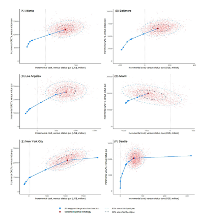
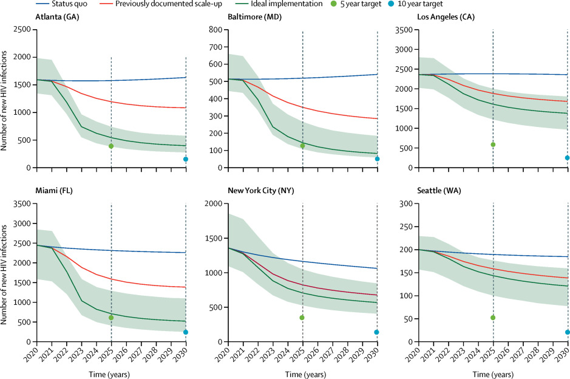
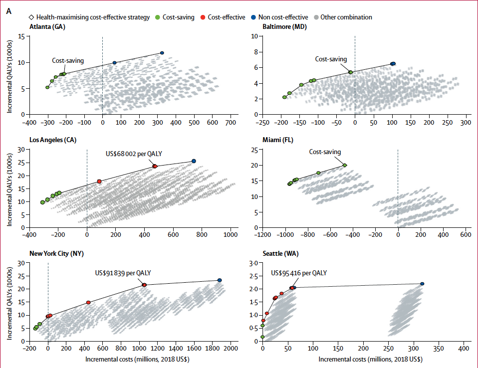

```{r, include = FALSE}
knitr::opts_chunk$set(
  collapse = TRUE,
  comment = "#>"
)
```

In this section we use the model outcomes data and matrices generated in Section 4.0 to create tables and plots that can be used for interpretation of results. Users can modify these tables and plots to customize outputs for dissemination and publication. For more information about ggplot2, see [here](https://ggplot2.tidyverse.org/).

$~$

# 5.0 Produce cost-effectiveness analysis (CEA) results table {-}


Using *CascadeCEA-Interventions-3-Analysis-CEATable(range).R* we produce a CEA table (`cea.table`) comparing the OCIS versus comparators. Users can specify whether CEA results for a single city or all cities should be produced. As there is no consensus threshold for WTP in the United States [@CEthreshold], we have defined cost effective interventions as those with an ICER below $100,000/QALY. CE Results are output as .csv files. The following is a list of the CEA outcomes that are calculated:

  + Incremental cost (point estimate, lower and upper bound)
  + Incremental QALYs (point estimate, lower and upper bound)
  + ICER (point estimate, lower and upper bound)
  + Percentage cost-effective
  + Percentage cost-saving

$~$

# 5.1 Disaggregated cost estimates {-}


In this component we derive and compare the disaggregated cost estimates for each city to identify strategies with the highest net monetary benefit (NMB). 

First we derive the disaggregated cost estimates for each city’s selected OCIS using *CascadeCEA-Interventions-3-Analysis-CostBreakdown.R* found in *03_Analysis*. Following this, we determine the comparison strategies (strategies proximal to the OCIS) that we want to consider using the *CascadeCEA-Interventions-3-Analysis-DetermineProximalStrategies.R* script. The number of proximal strategies for comparison can be set, it is currently set to 10. Note that there are two options provided in this script, the first option (default option) determines proximal strategies according to NMB. However, if OCIS is determined as cost-saving but ICER is greater than $100,000 USD relative to the comparator, Option 2 must be used. Option 2 uses the distance to the NMB of the OCIS. When using Option 1, further analyses to estimate proportions of the selected combinations being most cost-effective can be done using *CascadeCEA-Interventions-3-Analysis-PSA-ProportionMostCE.R*. The results generated must be manually copied into Excel. 

We then create a CEA frontier (also referred to as a “health production function” (HPF)), up to a given willingness-to-pay (WTP) level, by identifying strategies (combinations of interventions) with the highest NMB for each city or all cities. Creation of the HPF requires several steps and may take some time depending on how many strategies are considered, please be patient! Use *CascadeCEA-Interventions-3-Analysis-ProductionFunction.R* script for the following steps. 

First we load the costs and QALY values for all strategies. Then we narrow down the number of strategies by conducting two screenings of all possible strategies - first screening  removes strategies whose QALYs are lower than the least costly strategy, and the second screening removes strategies whose costs are higher than the strategy with highest QALYs. 


```{r, eval=FALSE}
# load the costs and QALY values for all strategies
outcome.comb <- readRDS(paste0("Combination/Outcome-All-Combination-", CITY, "-DM.rds"))
outcome.ref  <- unlist(readRDS(paste0("Inputs/Combination-DM-", CITY, "-refcase-outcomes.rds")))

CEmat                          <- rbind(outcome.ref[c("QALYs.sum", "costs.total.sum")], outcome.comb[ , c("QALYs.sum", "costs.total.sum")])
rownames(CEmat)[1]             <- "Ref"
rownames(CEmat)[2:nrow(CEmat)] <- c(1:(nrow(CEmat)-1))
Strategy.ind                   <- 1:dim(CEmat)[1]
CEmat                          <- cbind(Strategy.ind, CEmat)

# check for duplicated strategies
dups <- CEmat[c(duplicated(CEmat[,2:3]) | duplicated(CEmat[,2:3], fromLast = TRUE)),1]

# initialize some variables
costsCol <- 3; qalyCol <- 2

# 1st screening: remove stratgies whose QALYs are lower than the least costly strategy
lowestcost  <- as.numeric(which.min(CEmat[ , costsCol]))
CEmat       <- CEmat[(CEmat[ ,qalyCol] >= CEmat[lowestcost,qalyCol]), ]

# 2nd screening: remove stratgies whose costs are higher than the strategy with highest QALYs
highestqaly <- as.numeric(which.max(CEmat[ , qalyCol]))
CEmat       <- CEmat[(CEmat[ , costsCol] <= CEmat[highestqaly, costsCol]), ]

# Number of strategies remaining after screening
numStrat <- dim(CEmat)[1]
```

$~$

Following this, we find WTP levels to test so that all strategies on frontier will be captured, this requires testing on either side of all NMB intersections, which are simply all the pairwise ICER comparisons. Lastly, we find the strategy with the maximum NMB at each of the WTP test points `indicesOfMax`, this series creates the HPF. Lastly, we generate the cost-effectiveness results/table.


```{r, eval=FALSE}
outcome.comb <- readRDS(paste0("Combination/Outcome-All-Combination-", CITY, "-DM.rds"))
outcome.ref  <- unlist(readRDS(paste0("Inputs/Combination-DM-", CITY, "-refcase-outcomes.rds")))
combination.list <- readRDS("Combination/Combination.list.rds")

CEthreshold <- 100000  #cost-effectiveness threshold

frontier.matrix  <- rbind(outcome.ref[c("QALYs.sum", "costs.total.sum")], outcome.comb[frontier , c("QALYs.sum", "costs.total.sum")])

Strategy.ind     <- c(0, frontier)
frontier.matrix  <- cbind(Strategy.ind, frontier.matrix)

costsCol <- 3; qalyCol <- 2

frontier.matrix[ , qalyCol]  <- frontier.matrix[ , qalyCol]  - frontier.matrix[1, qalyCol]
frontier.matrix[ , costsCol] <- frontier.matrix[ , costsCol] - frontier.matrix[1, costsCol]

frontier.matrix <- frontier.matrix[-1, ]
frontier.matrix <- as.data.frame(frontier.matrix)

if (any(frontier.matrix$costs.total.sum < 0)){
  frontier.matrix$ICER[frontier.matrix$costs.total.sum < 0] <- "CS"
  NCS  <- sum(frontier.matrix$costs.total.sum < 0)  #number of cost savings
  if (NCS == nrow(frontier.matrix)){
    ocis       <- frontier.matrix$Strategy.ind[nrow(frontier.matrix)]
    comparator <- frontier.matrix$Strategy.ind[nrow(frontier.matrix) - 1]
  } else{
    frontier.matrix$ICER[(NCS+1):nrow(frontier.matrix)] <-
      diff(frontier.matrix$costs.total.sum[NCS:nrow(frontier.matrix)]) / diff(frontier.matrix$QALYs.sum[NCS:nrow(frontier.matrix)])
    icer <- as.numeric(frontier.matrix$ICER[(NCS+1):nrow(frontier.matrix)])  #ICER for non cost-saving strategies
    if (all(icer >= CEthreshold)){
      ocis       <- frontier.matrix$Strategy.ind[NCS]
      comparator <- frontier.matrix$Strategy.ind[NCS - 1]
    } else{
      ocis.ind   <- which.max(icer[icer < CEthreshold]) + NCS
      ocis       <- frontier.matrix$Strategy.ind[ocis.ind]
      comparator <- frontier.matrix$Strategy.ind[ocis.ind - 1]
    }
  }

} else{
  frontier.matrix$ICER[1] <- frontier.matrix$costs.total.sum[1] / frontier.matrix$QALYs.sum[1]
  frontier.matrix$ICER[2:nrow(frontier.matrix)] <-
    diff(frontier.matrix$costs.total.sum) / diff(frontier.matrix$QALYs.sum)
  ocis.ind   <- which.max(frontier.matrix$ICER[frontier.matrix$ICER < CEthreshold])
  ocis       <- frontier.matrix$Strategy.ind[ocis.ind]
  comparator <- frontier.matrix$Strategy.ind[ocis.ind - 1]
}

frontier.list <- list()
frontier.list$frontier   <- frontier
frontier.list$ocis       <- ocis
frontier.list$comparator <- comparator

saveRDS(frontier.list, paste0("Combination/ProductionFunction-Frontier-", CITY, ".rds"))

names(frontier.matrix) <- c("Strategy", "Incremental QALYs", "Incremental cost", "ICER")
write.xlsx(frontier.matrix, file = paste0("Outputs/Production Function Table/ProductionFunction.CEAResults-", CITY, ".xlsx"))
```

$~$

# 5.2 Plots {-}


The following modules allow users to re-produce and customize the plots and outputs from [@core].

To generate a 6 panel graph (one panel for each city) for the PSA ellipses for optimal combination intervention strategies, use *CascadeCEA-Interventions-3-Plot-Ellipse(PSA).R* found in the *R* directory. Figure 5.0 provides an example of what is produced using the script.

 

$~$

To generate plots for the number of new infections each year in each city over time, use *CascadeCEA-Interventions-3-Plot-NewIncidence.R* found in the *03_Analysis* folder. Both point estimates and 95% CI are provided. 



$~$

To visualize the health production function generated in 5.2 use *CascadeCEA-Interventions-3-Plot-ProductionFunction.R* found in the *R* directory. X-axis is “Incremental QALYs (1000s) and Y-axis is “Incremental costs (millions, 2018 USD).  This script automatically produces a 6 panel graph (one panel for each city), such as Figure 5.1.

 

$~$

# References {-}
